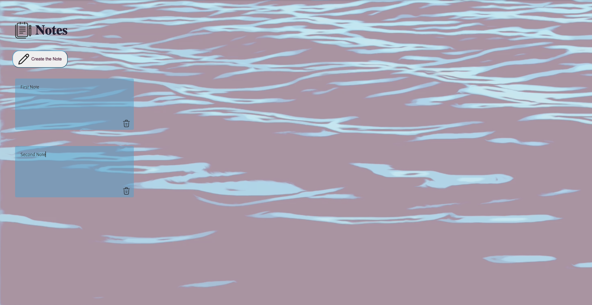

# ✨ What’s this about? 

Welcome to the Note App, a minimalist note-taking tool built purely with JavaScript, CSS, and HTML. This app is your virtual notepad, designed to help you jot down thoughts, ideas, or tasks on the fly. It’s easy, simple, and does one thing really well—creating, deleting, and saving notes. Plus, all of your notes are stored locally right in your browser, so you can pick up where you left off, no matter what.

## 📋 Features

Create Notes: Write anything and hit Enter—your note will appear right where you need it.
Delete Notes: Clicking the little trash icon next to a note will send it packing. Clean and simple.
Persistence: Thanks to localStorage, your notes won’t disappear when you refresh the page (or close and reopen your browser). They stick around, just like a trusty sticky note.

## 🔧 Built With

HTML: skeleton
CSS: styling
JavaScript: engine

 
